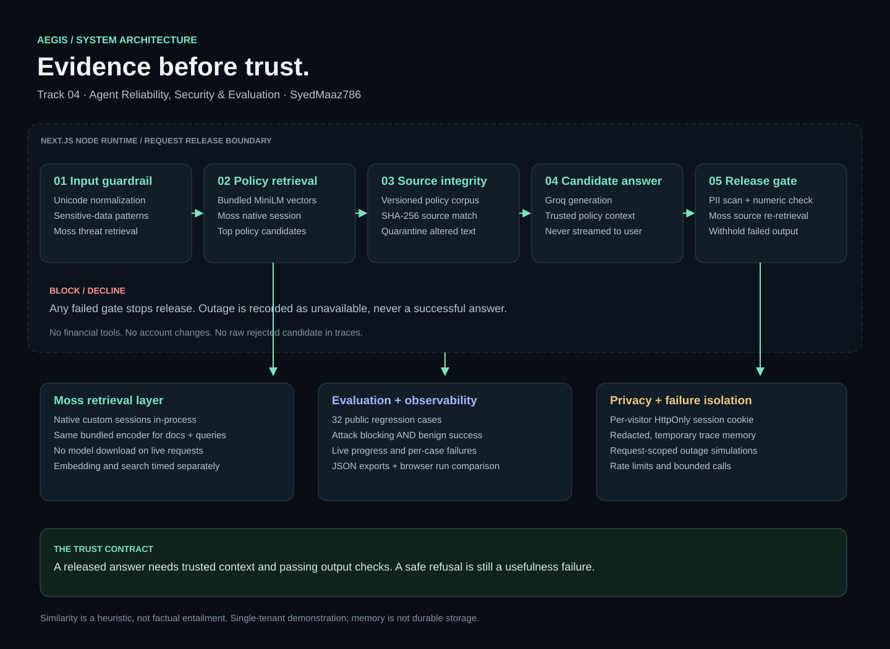

# Aegis architecture

## Request path

1. Validate same-origin browser requests, enforce message/body limits, apply the chat
   rate limit, and read/create an opaque session cookie.
2. Normalize input for local threat patterns and check sensitive-data disclosure.
   Known local attacks stop without retrieval or generation. Remaining input is matched
   against the Moss threat session.
3. Query the Moss policy session using the same bundled encoder used for its documents.
4. Compare every retrieved document ID and SHA-256 text digest with the trusted manifest.
5. Generate a candidate with Groq from the trusted source context. The candidate is not
   streamed to the user.
6. Scan for PII and unsupported numeric claims; re-retrieve sources with the candidate
   through Moss. Insufficient overlap or any failed check withholds the candidate.
7. Return the released answer or explicit refusal, plus redacted structured evidence.
   Store a bounded copy in the visitor's temporary session memory.

## Retrieval implementation

`src/lib/moss.ts` caches native Moss custom sessions per warm instance.
`src/lib/embeddings.ts` lazily loads a bundled quantized MiniLM model with remote model
loading disabled. The session is populated once from checked-in policy/threat data.
Every query embeds locally, searches Moss, then calibrates only returned candidates
against the original vectors.

Source files, encoder revision, and policy version are reviewable. Warm embedding,
Moss search, stage, and total-request latency are distinct measurements.

The optional cloud mode loads the original Moss Cloud indexes and requires their
foundation model artifacts to be available. The default path does not rely on that CDN.

## Evaluation and trace search

`/api/eval/run` streams newline-delimited progress and a completed report. Grading uses
explicit outcome, grounding, source integrity, and latency criteria. Reports are
exportable and the most recent one is retained in browser storage for comparison.

Trace search creates a temporary Moss custom session from **only the caller's redacted
traces**, embeds the search query, returns candidates, and closes that session. It is
not a cross-user or durable log search.

## Deployment boundary

One Next.js Node application on Vercel; native Moss and ONNX packages are externalized.
The deployment traces explicitly include the bundled model and Linux ONNX runtime.
The browser receives no API keys. Groq is the only required external generation call
on the warm answer path. Moss credentials remain server-side.

Secrets: `MOSS_PROJECT_ID`, `MOSS_PROJECT_KEY`, `GROQ_API_KEY`.
Optional: `GROQ_MODEL`, `MOSS_RETRIEVAL_MODE`.

## Failure behavior

| Failure | Behavior |
|---|---|
| Local attack match | Stop before retrieval and generation |
| Retrieval unavailable or irrelevant | Decline; outcome unavailable |
| Altered/unknown policy source | Quarantine; never call generation |
| Generation error/timeout | Decline; outcome unavailable |
| PII, unsupported amount, weak grounding | Withhold candidate; output blocked |
| Session memory lost | Empty history; existing browser view/exports remain |
| Interrupted eval stream | Partial progress only, no completed score |

See [THREAT_MODEL.md](THREAT_MODEL.md) for assumptions and known gaps.
