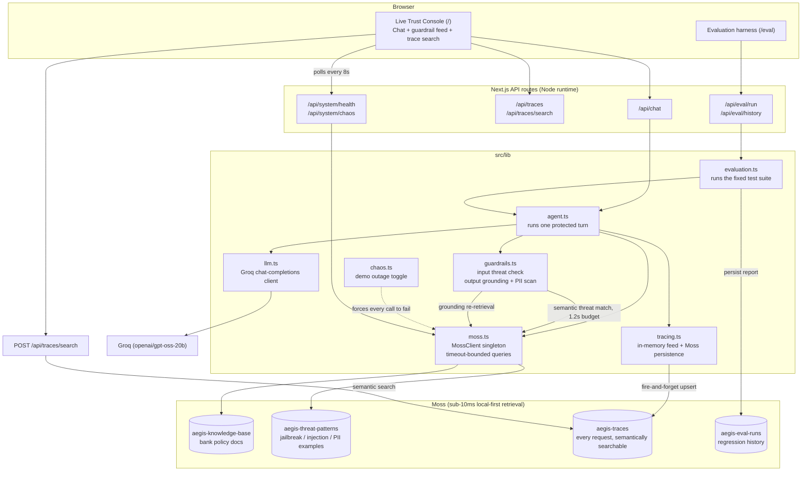
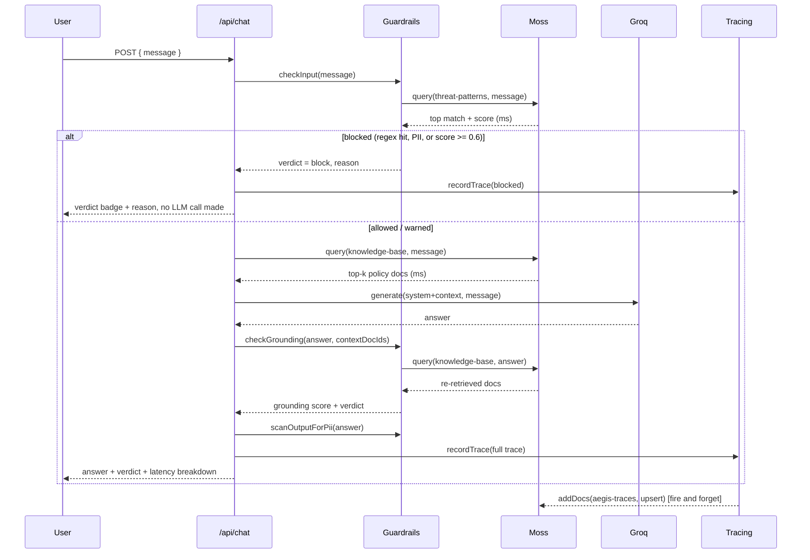

# Aegis — Architecture

Aegis is a single Next.js application (App Router, TypeScript) that wraps a RAG
support agent with a real-time trust layer. There is no separate backend
service: API routes run on the Node.js runtime and talk directly to Moss and
Groq.

## Component diagram

## Request lifecycle (one chat turn)

## Why this shape

- **One process, no network hop to a separate backend.** Moss already removes
  the vector-DB round trip; putting a second service between the browser and
  the agent would just reintroduce the latency Moss is designed to eliminate.
  API routes run on Vercel's Node runtime (not Edge, since the Moss SDK is a
  native addon) and call Moss and Groq directly.
- **Guardrails block *before* the LLM is ever called.** Prompt-injection and
  PII-exfiltration attempts are rejected by `checkInput` — a Moss query plus a
  regex pass — which is why blocked requests finish in well under 100ms
  instead of paying for a full LLM round trip. This is enforced by the eval
  suite's tight latency budget on adversarial cases (see `data/eval-cases.json`).
- **Grounding is checked by re-retrieval, not a second LLM call.** Rather than
  asking an LLM "was this answer grounded?" (slow, and just moves the
  hallucination risk one level up), `checkGrounding` re-queries the knowledge
  base using the agent's own answer as the query. A genuinely grounded answer
  re-retrieves the same documents it was given with a high score; an answer
  that drifted from its context does not. This is a direct, cheap use of
  Moss's sub-10ms retrieval as an evaluation primitive, not just a retrieval
  primitive.
- **Traces and eval runs are themselves Moss indexes.** Every request is
  upserted into `aegis-traces`, so "continuous evaluation" isn't just a batch
  job — you can semantically search live traffic ("show me blocked jailbreak
  attempts") from the dashboard. Eval runs persist to `aegis-eval-runs` so
  safety/grounding/latency can be tracked run over run, not just as a
  point-in-time score.
- **Global-scoped singletons for warm-instance reuse.** `MossClient`, the set
  of loaded index names, the trace ring buffer, and the rate limiter all live
  on `globalThis` so a warm serverless instance reuses the loaded index and
  open connections instead of re-paying Moss's `loadIndex()` cost on every
  request.
- **Every Moss call is timeout-bounded, not just try/catch-wrapped.** `mossQuery`
  (`src/lib/moss.ts`) races the actual Moss round trip against a hard deadline (1.2s
  on the input guardrail, 3s by default elsewhere) so a *slow* or hanging upstream
  fails exactly like a *down* one — the caller's existing fallback handles both
  identically. A single chokepoint (`getMossClient`) also checks a demo-only chaos
  flag (`src/lib/chaos.ts`), so `/api/system/chaos` can force every Moss call in the
  app to fail on command without touching any other code path.
- **Health is reported from real traffic, not a synthetic ping.** `/api/system/health`
  runs an actual `mossQuery` through the same `ensureLoaded`/timeout path production
  requests use, so the status banner it feeds can never claim "healthy" while real
  requests are failing, or vice versa.

## Data flow summary

| Moss index | Written by | Read by | Purpose |
|---|---|---|---|
| `aegis-knowledge-base` | `scripts/seed.ts` | `agent.ts` (retrieval), `guardrails.ts` (grounding re-retrieval) | The bank's actual policy content the agent answers from |
| `aegis-threat-patterns` | `scripts/seed.ts` | `guardrails.ts` (`checkInput`) | Example jailbreak / injection / PII / social-engineering phrasings to match against |
| `aegis-eval-cases` | `scripts/seed.ts` | (reference / future: dynamic suite loading) | The eval harness's test cases, also indexed for semantic lookup |
| `aegis-traces` | `tracing.ts` (every request) | `/api/traces/search` | Durable, semantically searchable history of every guardrail decision |
| `aegis-eval-runs` | `evaluation.ts` (every suite run) | `/api/eval/history` | Regression tracking across eval runs |
