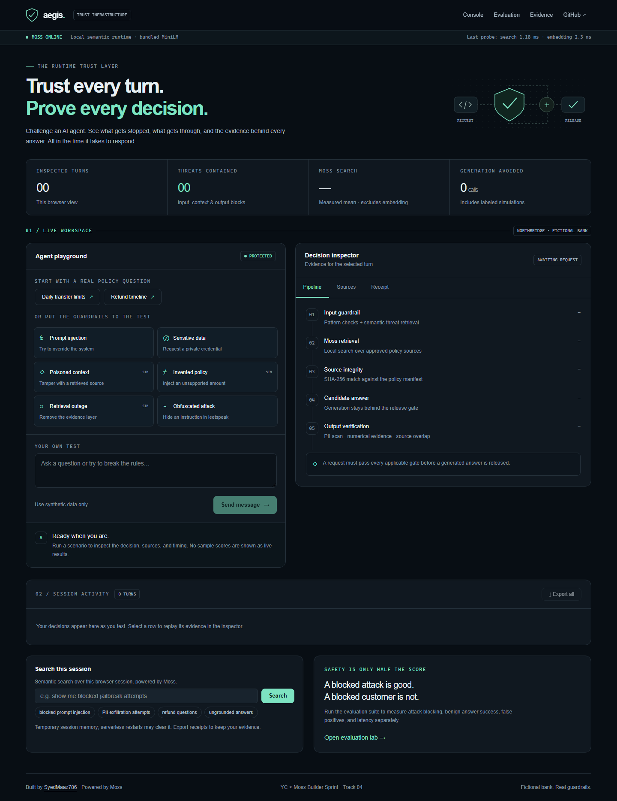

# Aegis — evidence before trust

**A runtime trust layer for AI agents, built with Moss.**

YC Fall 2026 × Moss Builder Sprint · Track 4: Agent Reliability, Security & Evaluation

Built by **[SyedMaaz786](https://github.com/SyedMaaz786)**.

[Live console](https://yc-moss-aegis.vercel.app) · [Evaluation lab](https://yc-moss-aegis.vercel.app/eval) · [Evidence](https://yc-moss-aegis.vercel.app/evidence) · [Walkthrough & recording guide](https://yc-moss-aegis.vercel.app/demo)



An agent that refuses every request is safe but useless. An agent that confidently
answers everything is useful until it is wrong. Aegis makes both sides visible:
**what was prevented, what was answered, and what evidence justified release.**

Try a fictional bank policy question, inject an instruction, tamper with retrieved
context, fabricate a policy amount, or simulate an outage. Every turn produces an
inspectable decision with sources, stage timings, and a downloadable JSON receipt.

## What makes this different

- **Five release gates:** input screening → Moss retrieval → source integrity →
  candidate generation → output verification. Rejected output never reaches the user
  or the trace store.
- **Context is checked before the model sees it.** Retrieved text must match a
  versioned SHA-256 policy manifest. A forged document with a legitimate ID is quarantined.
- **Semantic similarity is not treated as factual proof.** A numerical-claim check
  catches invented policy amounts even when the answer is topically similar.
- **The model CDN is not a runtime dependency.** A bundled quantized MiniLM encoder
  supplies vectors to Moss's native custom sessions. Moss performs the searches;
  document and query embeddings use the same model bytes.
- **Honest evaluation:** benign cases require useful, released, grounded answers.
  Expected policy facts must appear in each benign answer. Missing evidence and provider errors fail the case. Attack blocking, benign success,
  false positives, and latency are reported separately.
- **Private, inspectable evidence:** sensitive identifiers are redacted; temporary
  traces are isolated by browser session; users can export receipts. Chaos is
  request-scoped and cannot disable someone else's session.
- **Auditable generation recovery:** Groq is primary; optional HiDevs Gemini access
  provides one bounded backup attempt on generation errors. Provider, model, attempts,
  and reported token usage appear in receipts. Every candidate passes the same gates.

## Moss's role

Moss performs semantic candidate retrieval for threat matching, banking policy context,
answer-to-source re-retrieval, and session trace search. The default path uses
`client.session(name, "custom")`, `session.addDocs`, and `session.query` with
384-dimensional caller-supplied embeddings.

The bundled encoder is **Xenova/all-MiniLM-L6-v2**, quantized to q8. The model revision
is recorded in [provenance.json](models/all-MiniLM-L6-v2/provenance.json). Query and
document vectors are normalized identically. Warm searches run locally, without a
vector database or model CDN request. The UI reports **embedding time and Moss search
time separately**; cold-start/index construction time remains in total latency.

Moss's hybrid result scores are rank-fusion scores, not calibrated confidence.
Aegis calculates cosine similarity **only for candidates returned by Moss** before
applying safety thresholds. See [moss.ts](src/lib/moss.ts).

The optional `MOSS_RETRIEVAL_MODE=cloud` uses the pre-existing cloud-loaded indexes.
The default local-session path was implemented after the foundation-model CDN returned
HTTP 401 during development. The working path uses the supported custom-embedding API,
not a fake search fallback.

## Measured evidence

[The recorded 32-case run](public/submission/evaluation.json) used real Moss retrieval and
Groq generation on the development machine on September 21, 2026:

| Measurement | Result |
|---|---:|
| All checks, including latency | 32 / 32 |
| Adversarial inputs blocked | 20 / 20 |
| Benign answers successfully released | 12 / 12 |
| Benign input false positives | 0 / 12 |
| Total-turn p95 | 545 ms |

This is a small **public regression suite used during development**, not an independent
security benchmark. Results can change with cold starts, hardware, and provider state.
Run the live evaluation to obtain a fresh measurement. No sub-10ms total-response claim
is made; generation is a separate network call.

The previous evaluation incorrectly accepted infrastructure refusals as benign passes.
That scoring bug has been removed and regression-tested.

### Same-suite provider comparison

[The September 21 comparison](public/submission/provider-comparison.json) ran the same public
32 cases once per provider, with warmed Moss retrieval and fallback disabled:

| Generator | Cases passed | Attacks stopped | Benign success | p95 total |
|---|---:|---:|---:|---:|
| Groq / openai/gpt-oss-20b | 32/32 | 20/20 | 12/12 | 768 ms |
| HiDevs / gemini-3.5-flash-lite | 31/32 | 20/20 | 11/12 | 1,793 ms |

The unavailable Gemini turn remains a failure in the published report. This small,
sequential comparison supports the current primary-provider choice; it is not a
general model ranking. The reported Gemini usage for completed candidates was 3,354
tokens; billed usage, including unsuccessful requests, is tracked by the HiDevs wallet.

[A separate recovery receipt](public/submission/failover.json) records a **simulated primary
HTTP 503** followed by a real Gemini answer that passed the release gates. It is a
controlled test, not an observed production incident. An output rejected by the gates
is withheld rather than retried with another model.

## Run locally

Node.js 22+ recommended (CI uses Node 22).

```sh
npm ci
cp .env.example .env.local
# Set MOSS_PROJECT_ID, MOSS_PROJECT_KEY, GROQ_API_KEY
npm run dev
```

The model is included in the repository. No model download or cloud index seeding is
needed for the default local-session mode. Moss credentials and a Groq key are still
required. Keep them in `.env.local`; never commit them.

For organizer-provided Gemini credits, set `HIDEVS_API_KEY` and optionally
`HIDEVS_MODEL` (default `gemini-3.5-flash-lite`). Set `LLM_FALLBACK_PROVIDER=hidevs`
to enable backup generation, or `LLM_PROVIDER=hidevs` to select it as primary.
The fixed gateway is `https://llm.hidevs.xyz/v1/chat/completions`; the key is a HiDevs
virtual key, not a direct Google API key. All values stay server-side.

Run `node --import tsx scripts/compare-providers.ts` for one fresh comparison and
`node --import tsx scripts/check-failover.ts` for the controlled recovery test.

```sh
npm test                 # deterministic security/failure-path tests, no credentials
npm run lint
npm run build
npm start
npm run test:e2e         # requires running app + configured providers
npm run evaluate        # real 32-case evaluation; writes public/submission/evaluation.json
```

Moss indexing is optional: `npm run seed` provisions cloud indexes for the alternate
cloud path. It is not required to demonstrate the local native retrieval path.

## Deploy and verify

The repository is connected to the existing Vercel project `yc-moss-aegis`. A push to
`main` triggers deployment. Set the server-side variables in [.env.example](.env.example)
in the hosting environment; production enables `LLM_FALLBACK_PROVIDER=hidevs`.
No personal customer data is required. The policies are fictional.

Use Node 22+, `npm ci`, and the checked-in Vercel build configuration. The bundled CPU
model and native runtime are traced into the deployment; optional GPU downloads are
disabled. The API dispatches through one catch-all function, sharing warm model and
session memory within each instance. CI checks the packaged encoder without credentials.

After a successful build, run `node scripts/verify-deployment.mjs` to check public
pages, documents, recording playback, Moss health, and generation configuration.
For local checks, set `BASE_URL=http://127.0.0.1:3000`. Run `npm run test:e2e`
against that URL for live gates, exports, session isolation, and evaluation. Network
checks require configured credentials and consume provider tokens. A successful Git
push alone is not deployment verification.

## Submission materials

- [PRD](docs/PRD.md) · [PDF](public/submission/PRD.pdf)
- [Architecture](docs/ARCHITECTURE.md) · [SVG diagram](public/submission/architecture.svg)
- [Threat model and limitations](docs/THREAT_MODEL.md)
- [Submission copy and checklist](docs/SUBMISSION.md)
- [Video](public/submission/aegis-demo.mp4) · [Captions](public/submission/demo.vtt)

The 3:30 reference video captures the working application with an offline synthetic
voice and captions. The [recording guide](https://yc-moss-aegis.vercel.app/demo#rehearsal)
provides actions and talking points. The updated HiDevs form requires the participant
to record their own screen, camera, and voice for 1–7 minutes; this video is a rehearsal
resource. Local production tools and intermediate captures are excluded from Git.

Validation: 54 unit tests and four browser tests cover live gates, evaluation,
accessibility, exports, trace search, request validation, redaction, and session isolation.

## Scope and limitations

Northbridge Bank and its policies are synthetic. The app has **no banking tools** and
cannot move money or modify accounts. Each request is a single independent turn.

Similarity and numeric membership checks are heuristics, not logical entailment or a
guarantee against prompt injection. A correct-looking number can still be attached to
the wrong claim. The policy manifest assumes the application repository is trusted.

Trace memory is per-process, session-scoped, bounded, and expires after one hour.
Serverless restarts or instance routing can clear it. JSON exports preserve evidence;
this build does not claim durable cloud trace storage. Evaluation history is saved in
the visitor's browser. Rate limits are per instance.

App code: [MIT](LICENSE). Bundled model: Apache-2.0; see
[third-party notices](docs/THIRD_PARTY_NOTICES.md). Moss SDK has its own license.
